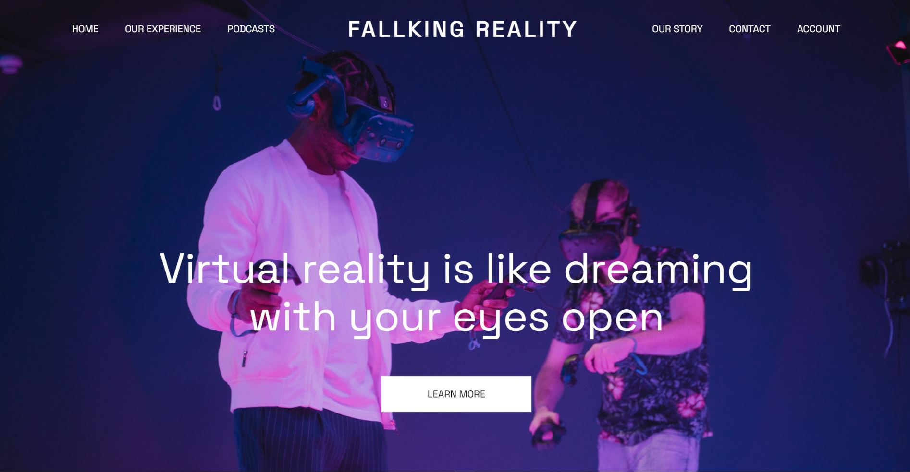
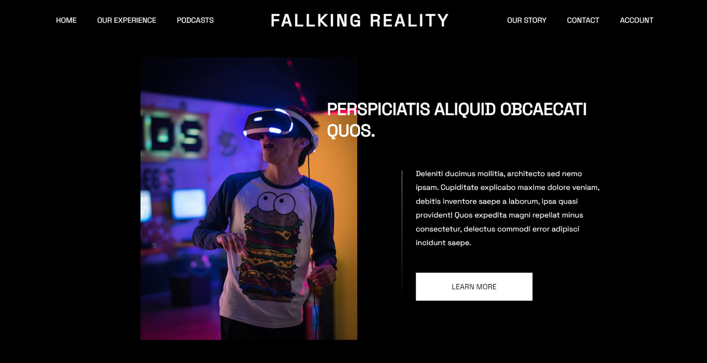
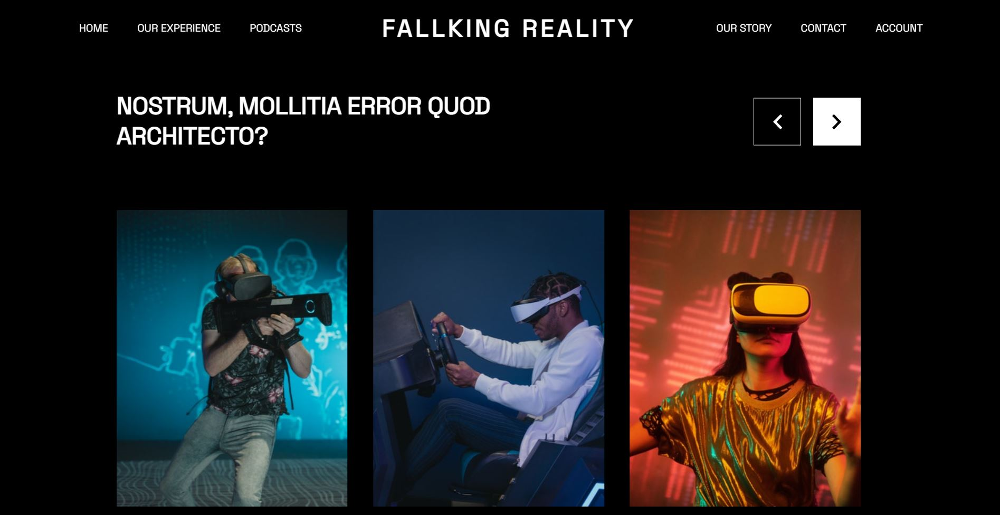

# FallKing-Reality

FallKing Reality, a sample website for VR/AR Showcase summit built with HTML5/CSS3 &amp; JavaScript, uses rolly.js for smooth parallax and scenes manager.

# Useful Resources

[rolly.js](https://github.com/mickaelchanrion/rolly)

[Slick carousel](https://kenwheeler.github.io/slick/)

[Pexels](https://www.pexels.com/)

# License & copyright

@ Harshvardhan Joshi

License under the [MIT License](LICENSE)
